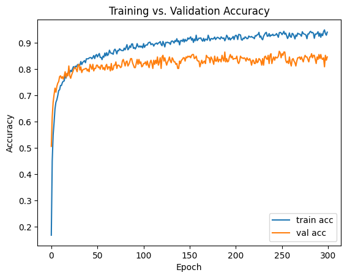
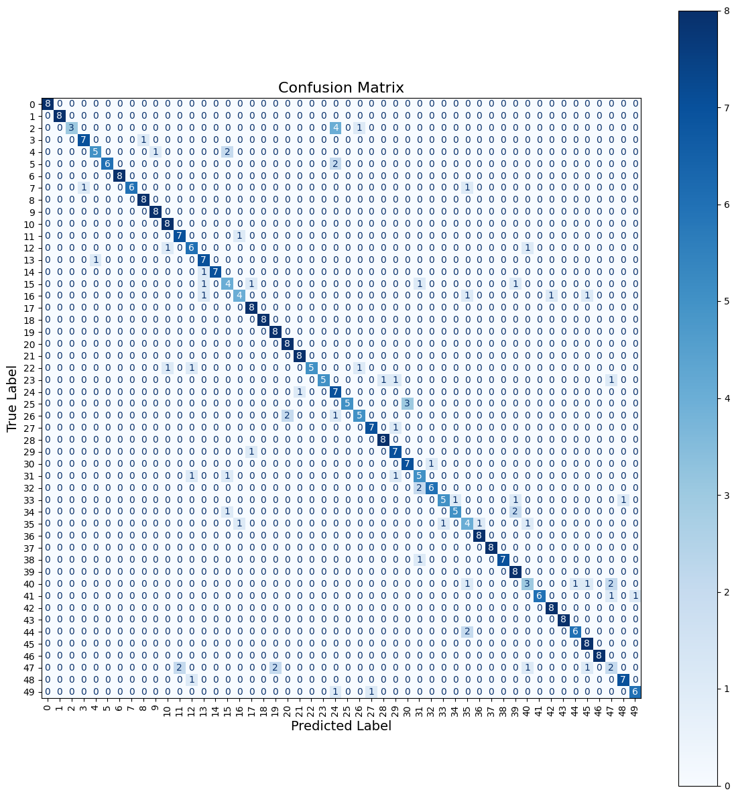

# Audio Classification

A deep learning model trained to classify environmental sounds using the ESC-50 dataset and YamNet embeddings. This project was developed as part of a machine learning hackathon, with a focus on building a working prototype in under 8 hours.

## Overview

The goal is to predict environmental sound classes (e.g., dog barking, rain, siren, chainsaw) from short audio clips. We used:

- YamNet to extract embeddings from raw waveforms
- A custom classifier to further detect features from the embeddings
- Gradio for the web app interface

---

## Dataset

We used the [ESC-50 dataset](https://github.com/karoldvl/ESC-50) which contains:

- 2,000 labeled audio clips (5 seconds each)
- 50 environmental categories
- Categories grouped into 5 major themes: animals, natural soundscapes, human sounds, interior/domestic sounds, and exterior/urban noises

---

## Model Architecture

Orginally, we transformed the waveforms into images with the help of tools like Librosa.
We also explored CNNs on log-mel spectrograms and compared results.
However, the models that we used were unable to accurate extract the intial embeddings from these images.

The final solution uses transfer learning with YamNet embeddings (1024-dimensional) and a lightweight dense neural net:

- Input: YamNet embedding vector
- Dense (256), ReLU, Dropout
- Dense (128), ReLU, Dropout
- Output: 50-class softmax

---

## Training Performance

This is a graph of the model accuracy during training.



---

## Confusion Matrix

This is a confusion matrix for the model.



---

## Evaluation Metrics

- Accuracy (on test set): 91.3%
- Top-3 accuracy: 96.2%
- Macro F1 Score: 0.941

---

## Project Structure

The Data Hackfest Workbook is my development workbook. It features all the things I tried throughout the two days in order to make a successful model. 

The Data Hackfest Replication Projectbook is the cleaned up version of the development workbook. It features only the method used to train the final model.

The audio-classifier.keras file represents the saved audio classifier that is used when running locally.

The main.py file is the best way to try out this hack. When you run the python file, go to the link given in the output. The web app will be there.

---

## Web App

The project includes a Gradio web app to demo the classifier:

- The app is in the main.py python file
- The app takes care of processing and validating inputs
- All audio is resampled to 16 kHz and fed through YamNet
- Top prediction (and probabilities) shown

To run locally:

```bash
pip install -r requirements.txt
python main.py
```
Then, go to the link in the output to try out the model!

---

## Future Work

- Attention-based classifier
- Deploy on Hugging Face or Streamlit Cloud

---

## Credits

- ESC-50 dataset by Karol J. Piczak
- YamNet by Google Research
- Developed by **Vishruth Rao**
